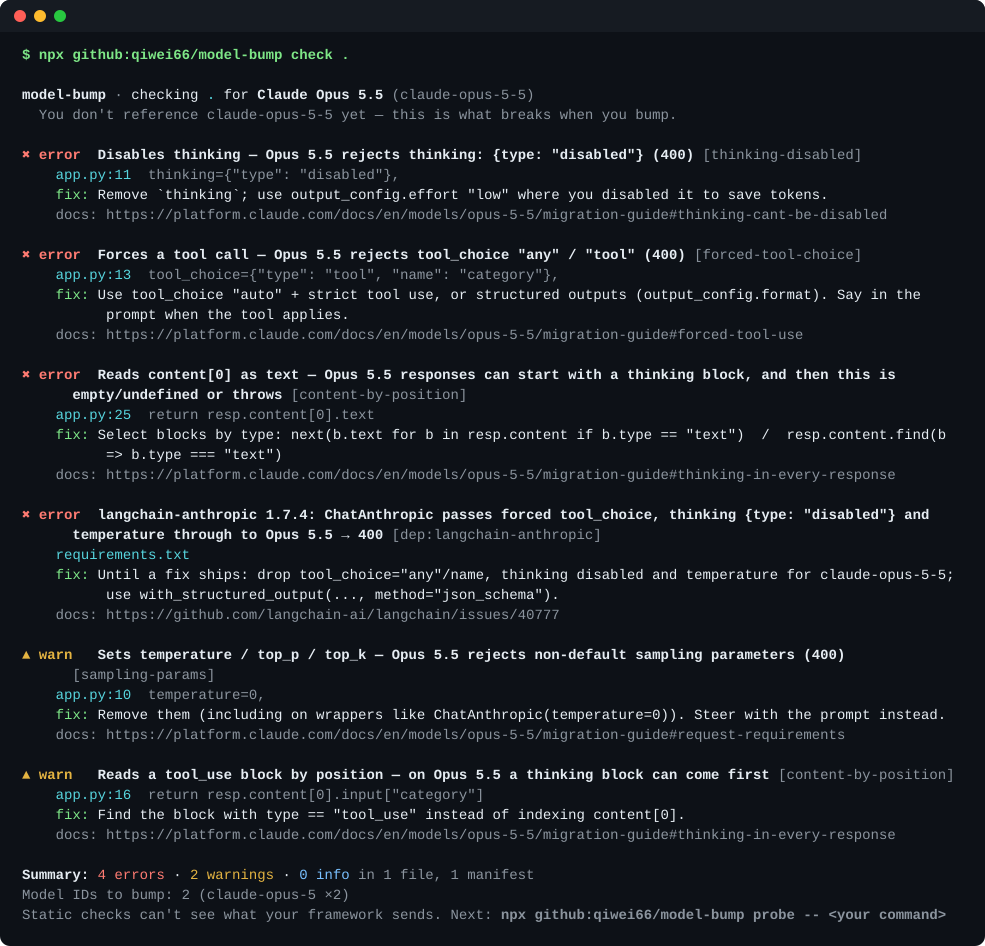
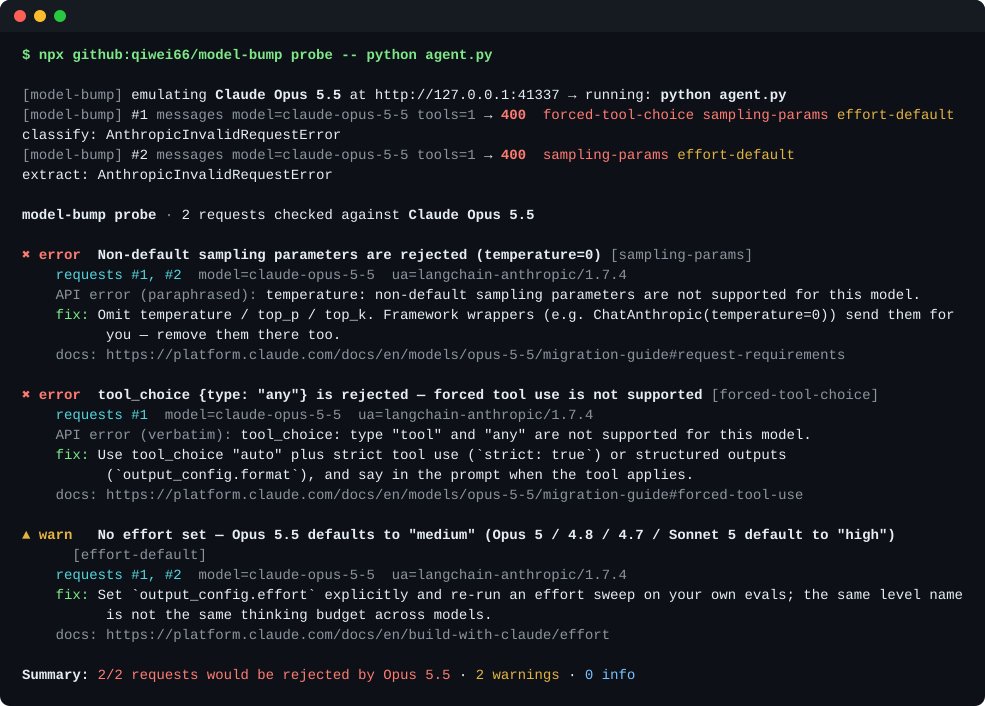

<div align="center">

# model-bump

**Will your code survive the bump to Claude Opus 5.5?**

Find the Opus 5.5 breaking changes in your code, your dependencies, and the requests your framework *actually sends*. Before production does.

No API key. No install. Nothing leaves your machine.

[English](README.md) · [简体中文](README.zh-CN.md)



</div>

```bash
# 1. Static scan: code + lockfiles
npx github:qiwei66/model-bump check .

# 2. Run your real app against a local fake Opus 5.5, which rejects exactly what the real one rejects
npx github:qiwei66/model-bump probe -- python app.py
```

## Why

[Claude Opus 5.5](https://platform.claude.com/docs/en/models/opus-5-5/migration-guide) costs less per token ($4 / $20 per MTok, down from $5 / $25), so everyone wants to swap the model ID. But it also:

| Change | What happens if you only swap the ID |
|---|---|
| Thinking is always on | `thinking: {type: "disabled"}` → **400**. `budget_tokens` → **400** |
| No forced tool use | `tool_choice: {type: "any" \| "tool"}` → **400** |
| Responses start with a `thinking` block | `response.content[0].text` → **crash / empty string** |
| Thinking blocks are bound to the conversation | a tool loop that filters them out of the assistant turn → **400** |
| Sampling params are gone | `temperature=0` → **400** |
| Effort default changed | `high` → `medium`. Same level name, different thinking budget |
| Computer use tool replaced | `computer_20251124` → **400** on the Claude API / Google Cloud |

Most of these don't live in *your* code. They live in the framework between you and the API. So we ran real frameworks against model-bump's fake Opus 5.5 and looked at what they send:

| Stack (tested 2026-09-24) | What happens on `claude-opus-5-5` |
|---|---|
| `anthropic` Python 1.8.0 | `resp.content[0].text` → `AttributeError: 'ThinkingBlock' object has no attribute 'text'` |
| `langchain-anthropic` **1.7.3 and 1.7.4** | `bind_tools(tool_choice="any")`, `thinking={"type":"disabled"}`, `temperature=0` are sent as-is → **400**. `with_structured_output()` no longer forces the tool → `OutputParserException` whenever the model answers in text |
| `litellm` 1.102.1 | forced `tool_choice` / `temperature` → `UnsupportedParamsError`. With `drop_params=True` the forced choice **silently becomes `auto`**. `response_format` is sent as the deprecated `output_format` |
| `ai` 7.0.113 + `@ai-sdk/anthropic` 4.0.62 | `toolChoice: "required"` is downgraded to `auto` with a warning, then `ToolChoiceViolationError` when the model doesn't call a tool |
| Hand-rolled tool loops (any SDK) | `content.filter(b => b.type !== "thinking")` before sending tool results → **400** |

## We scanned 39 popular open-source AI repos

`model-bump check --skip-tests`, 2026-09-24. [Full table with commits →](docs/survey.md)

- **11 repos read `content[0].text` from a Claude response: 125 call sites.** 104 of them are in Anthropic's own cookbook, courses and quickstarts, which is where most of us copied the pattern from.
- 22 repos send `budget_tokens` somewhere and 7 force a `tool_choice`. Most of these are multi-model routers that gate parameters by model, so what matters is whether their model tables already know about `claude-opus-5-5`.

These are call sites that fail *if they run against* Opus 5.5. It doesn't mean any of these projects is broken today.

## `check`: static scan

```bash
npx github:qiwei66/model-bump check [path] [--skip-tests] [--json] [--fail-on error|warn|never]
```

- **Code**: Python, TypeScript/JavaScript, notebooks (`.ipynb`), Java/Kotlin, Go, Ruby, PHP, C#.
- **Dependencies**: `requirements*.txt`, `pyproject.toml`, `poetry.lock`, `uv.lock`, `Pipfile.lock`, `package.json`, `package-lock.json`, `pnpm-lock.yaml`, `yarn.lock`, matched against a [table of known-broken framework versions](src/rules/deps.js).
- Lists every older Claude model ID you'll need to bump.
- Silence a line with a `model-bump-ignore` comment.

## `probe`: a fake Opus 5.5 for your real app

```bash
npx github:qiwei66/model-bump probe -- python app.py
npx github:qiwei66/model-bump probe -- npm test
npx github:qiwei66/model-bump probe --serve        # then set ANTHROPIC_BASE_URL yourself
```



`probe` starts a local server that speaks the Messages API and behaves like `claude-opus-5-5`:

- It **rejects** what Opus 5.5 rejects, with the same 400 error shape (and the documented error text where the docs give it), so your error handling is exercised for real.
- It **answers** everything else like Opus 5.5 does: a `thinking` block first, then text. Streaming (SSE) included. Code that reads `content[0].text` breaks here the way it will in production.
- `--simulate-tools` makes the mock call your first tool, then checks that your loop sends the `thinking` block back unmodified.
- It sets `ANTHROPIC_BASE_URL` (official SDKs, Vercel AI SDK, Agent SDK), `ANTHROPIC_API_URL` (LangChain) and `ANTHROPIC_API_BASE` (LiteLLM) for the child process, plus a dummy API key. Your real key is never needed.
- `--lenient` answers violations with 200, so one run finds every issue. `--dump dir/` saves the captured payloads.

It validates every request **as if** it were sent to Opus 5.5, whatever model ID your code uses today. Probe first, then bump.

> Bedrock / Vertex / Foundry clients don't read `ANTHROPIC_BASE_URL`. Point the app at the Anthropic provider for the probe run.

## CI

```yaml
# .github/workflows/model-bump.yml
on: [pull_request]
jobs:
  model-bump:
    runs-on: ubuntu-latest
    steps:
      - uses: actions/checkout@v4
      - uses: qiwei66/model-bump@main
        with:
          fail-on: error     # or: warn / never
          args: --skip-tests
```

Findings show up as inline annotations on the PR diff.

## Rules

Run `npx github:qiwei66/model-bump rules` for the full list. Every rule links to the section of the [official migration guide](https://platform.claude.com/docs/en/models/opus-5-5/migration-guide) it comes from.

| id | severity | catches |
|---|---|---|
| `thinking-disabled` / `thinking-budget` | error | `thinking: {type: "disabled" \| "enabled"}`, `budget_tokens` |
| `forced-tool-choice` | error | `tool_choice` any/tool, LangChain `tool_choice="any"`, LiteLLM `"required"`, Vercel `toolChoice: "required"` |
| `content-by-position` | error | `content[0].text`, `content[0]["text"]`, `content().get(0).text()` |
| `computer-use-legacy` | error | `computer_20251124`, `computer-use-2025-11-24` |
| `thinking-dropped` (probe) | error | thinking blocks filtered or edited in a tool loop |
| `sampling-params` | warn / error in probe | `temperature`, `top_p`, `top_k` |
| `assistant-prefill` | warn / error in probe | message list ending with an assistant turn |
| `framework-structured-output` | warn | LangChain / Vercel-on-Bedrock structured output paths |
| `effort-default` | warn (probe) | no `effort`: now `medium`, was `high` |
| `max-tokens-*` | warn (probe) | `max_tokens` too small now that it covers thinking + text |
| `silent-structured-output` | warn (probe) | synthetic JSON tool sent without a forced choice |
| `stream-first-block` | warn | stream handlers that special-case block index 0 |
| `obsolete-beta`, `output-format-deprecated`, `refusal-unhandled` | info | cleanup |

## FAQ

**How is this different from `/claude-api migrate`?** Anthropic's skill rewrites *your* code inside Claude Code, and it's great. model-bump checks the parts it can't see: your dependency versions and the payloads your framework builds at runtime. It also runs in CI and needs neither Claude Code nor an API key. Use both.

**Does it call Anthropic?** No. Both commands are fully local.

**Is this official?** No. model-bump is an independent open-source project, not affiliated with Anthropic.

**A framework shipped a fix. The table is stale!** Please open a PR against [`src/rules/deps.js`](src/rules/deps.js). This table goes stale fastest, and every entry links to its upstream issue.

## Roadmap

- [ ] `model-bump effort`: sweep your own prompts across effort levels on the old and new model (bring your own key) and report cost, latency and tokens side by side
- [ ] Rule packs for the next model releases (`--to <model>`)
- [ ] Bedrock / Vertex request shapes in `probe`

---

If model-bump saved you a 400 in production, a ⭐ helps the next person find it.

MIT © qiwei66
